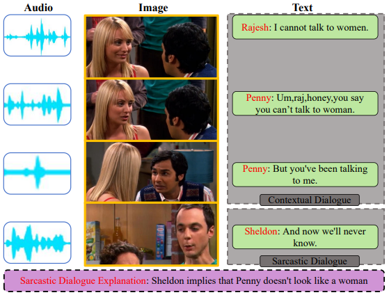
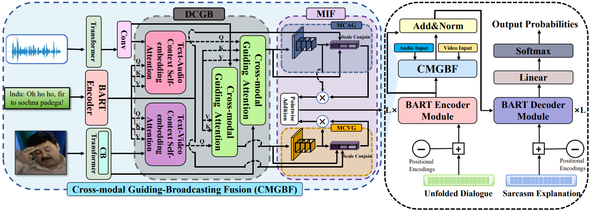

# 🤣👉CCG-Net👈

## 🔥Overview

  

## 📣Quick start:
- Place the text, audio, and video feature files in the format as described above in the following manner in the 'Data' folder:
WITS Dataset_link：https://github.com/LCS2-IIITD/MAF  
  - Data
    - Text
      - train_text.json
      - val_text.json
      - test_text.json
    - Audio
      - train_audio.p
      - val_audio.p
      - test_audio.p
    - Video
      - train_video.p
      - val_video.p
      - test_video.p 

  MUStARD Dataset_link: 
  -**Text data** - It is available at https://github.com/soujanyaporia/MUStARD in data/sarcasm_data.json location. We also provide train, valid and text dlog ids with them.  
  -**Audio data** - We first obtain raw video from https://github.com/soujanyaporia/MUStARD and convert those videos to audio format corresponding to the last utterance   of every dialog. The we proceed to obtain audio features in the same manner 	as described in https://github.com/thuiar/MIntRec/tree/main/tools/audio_preprocess.py  
  -**Video data** - We get raws videos from https://github.com/soujanyaporia/MUStARD and obtain the video features corresponding to last utterance from https://github.com/soujanyaporia/MUStARD under Run the code section point 3 Download the pre-		extracted visual features.  

- Subsequent install the dependencies mentioned in the requirement.txt.  
- Finally run model_driver.py file 
    

    
